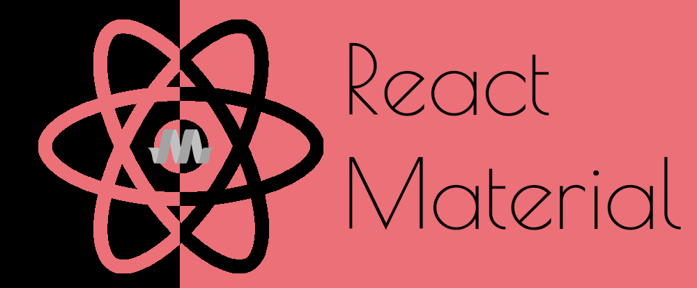

# React Material v0.0.1-beta
  

**React Material** is a simple, yet efficient and advanced ReactJS wrapper library for MaterializeCSS UI framework. You can build awesome UI for your web applications using MaterializeCSS Components built and wrapped in ReactJS.

## Motivation
[MaterializeCSS Framework]() has been my favourite UI library since its inception. Since then I have used MaterializeCSS for all of my personal, hobby projects as wll as in the projects I worked officially. MaterializeCSS emphasizes on Google's Material Design Principle which makes use of flat UI rich in colors and motion. Google's Android operating system makes use of this design principle. MaterializeCSS framework brings Material Design into the world of web applications.  

## Build Status

## Getting started

## Installation

## Dependency

## Changelog

## API Reference

## Tests

## Continuous Integration

## Contributing
Please read [CONTRIBUTING.md](https://github.com/reactMaterial/react-material/blob/master/CONTRIBUTING.md) for details on contributing to the project and [CODE_OF_CONDUCT.md](https://github.com/reactMaterial/react-material/blob/master/CODE_OF_CONDUCT.md) for the process for submitting pull requests to us.

## Versioning
We use [SemVer](https://semver.org/) for versioning. For the versions available, see the [tags](https://github.com/reactMaterial/react-material/tags) on this repository.

## Authors
* [Sandeep Vattapparambil](https://github.com/SandeepVattapparambil) - Creator and maintainer of the project.

## License
MIT License

Copyright (c) 2018 Sandeep Vattapparambil

Permission is hereby granted, free of charge, to any person obtaining a copy
of this software and associated documentation files (the "Software"), to deal
in the Software without restriction, including without limitation the rights
to use, copy, modify, merge, publish, distribute, sublicense, and/or sell
copies of the Software, and to permit persons to whom the Software is
furnished to do so, subject to the following conditions:

The above copyright notice and this permission notice shall be included in all
copies or substantial portions of the Software.

THE SOFTWARE IS PROVIDED "AS IS", WITHOUT WARRANTY OF ANY KIND, EXPRESS OR
IMPLIED, INCLUDING BUT NOT LIMITED TO THE WARRANTIES OF MERCHANTABILITY,
FITNESS FOR A PARTICULAR PURPOSE AND NONINFRINGEMENT. IN NO EVENT SHALL THE
AUTHORS OR COPYRIGHT HOLDERS BE LIABLE FOR ANY CLAIM, DAMAGES OR OTHER
LIABILITY, WHETHER IN AN ACTION OF CONTRACT, TORT OR OTHERWISE, ARISING FROM,
OUT OF OR IN CONNECTION WITH THE SOFTWARE OR THE USE OR OTHER DEALINGS IN THE
SOFTWARE.

## Acknowledgements
Thanks and kudos to: 
* [MaterializeCSS](https://github.com/dogfalo/materialize/) team for creating a wonderful UI library.
* [Facebook & React](https://reactjs.org/) team for creating an amazing modern javascript UI framework.

Made with ❤️ by Sandeep Vattapparambil.
